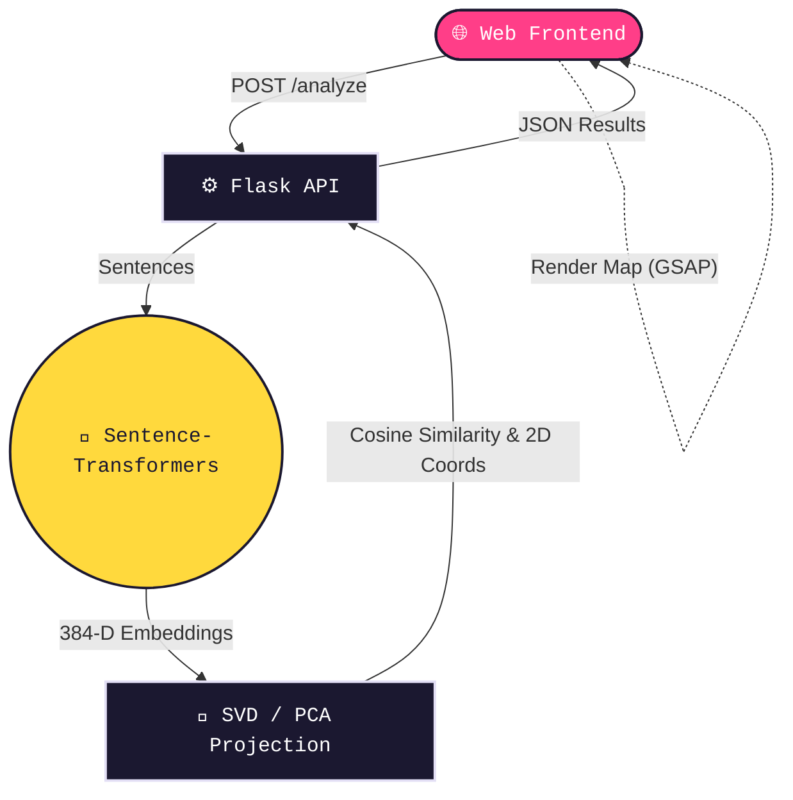

<div align="center">
  
</div>

<p align="center">
  <a href="#"></a>
  <a href="#"></a>
  <a href="#"></a>
  <a href="#"></a>
  <a href="#"></a>
</p>

<div align="center">
  <a href="https://semantix-fvtx.onrender.com/">
    
  </a>
</div>

<br>

## 🌌 Overview

**Vector Playground** is a sleek, interactive web application that visualizes semantic sentence similarity. By converting text into high-dimensional vectors (embeddings) and projecting them down to 2D space, it allows you to literally *see* the meaning of sentences.

- **Dynamic Visualizations:** Watch sentences map out and connect in real-time.
- **Top Matches:** Automatically computes pairwise cosine similarity and highlights the strongest matches.
- **Modern UI:** Built with premium typography, fluid liquid cursor, micro-interactions, and beautiful GSAP animations.
- **Fast & Lightweight:** Relies purely on Flask and `all-MiniLM-L6-v2` under the hood. No heavy database dependencies.

---

## 🧠 Concepts Explained

This project serves as an interactive playground to understand the foundational concepts of modern Natural Language Processing (NLP) and Retrieval-Augmented Generation (RAG).

### 1. What are Embeddings?
An **embedding** is a way to represent text as a dense list of numbers (a vector). Instead of just looking at the exact characters in a string, models like `all-MiniLM-L6-v2` analyze the context and *meaning* of the text. For example, "kitten" and "cat" are spelled differently but have very similar meanings, so their numerical embeddings will look nearly identical. In this app, every sentence is compressed into a **384-dimensional vector**.

### 2. The Vector Space
Imagine a 3D space with an X, Y, and Z axis. Now imagine a space with **384 axes**. That is the **Vector Space** where our sentences live. Sentences with similar semantic meanings cluster closely together in this space, while unrelated sentences are pushed far apart. 
Because humans can't visualize 384 dimensions, this application uses a mathematical technique called **PCA (Principal Component Analysis)** via SVD to squash those 384 dimensions down to just 2 dimensions (X and Y) so we can plot them on your screen.

### 3. Cosine Similarity
How do we know if two sentences are similar? We measure the angle between their vectors in the vector space. **Cosine Similarity** is a metric ranging from `-1` (completely opposite) to `1` (exactly identical). 
- If two vectors point in the exact same direction, the angle is 0°, and the cosine similarity is `1.0`.
- If they are unrelated, the angle is 90°, and the similarity is `0.0`.
The app calculates this score for every possible pair of sentences to find the "Top Matches" and draw the connecting dotted lines.

### 4. How the Application Works
1. **Input:** You type a list of sentences into the sleek web interface.
2. **Encoding:** The Flask API sends these sentences to the `Sentence-Transformers` model, which converts each sentence into its 384-dimensional embedding.
3. **Scoring:** The backend calculates the Cosine Similarity between every single pair of embeddings to find out which sentences mean the same thing.
4. **Projection:** Using Singular Value Decomposition (SVD), the 384-dimensional coordinates are flattened into 2D coordinates.
5. **Visualization:** The browser receives the coordinates and similarity scores, and uses GSAP to smoothly animate the nodes into their vector positions on the 2D map.

---

## 🏗️ Architecture



---

## 🚀 How to Run Locally

### 1. Install Dependencies
Make sure you have Python 3.10+ installed.
```bash
pip install flask sentence-transformers scikit-learn numpy
```

### 2. Start the Flask Server
```bash
python app.py
```
*Note: On first run, it will automatically download the `all-MiniLM-L6-v2` model.*

### 3. Open the Playground
Navigate to the URL provided in your terminal (usually [http://127.0.0.1:5002](http://127.0.0.1:5002)) and start exploring!

---

## 🎨 Design System

This project embraces a modern, playful, yet premium design language:

- **Typefaces:** `Bricolage Grotesque` for bold impact, `Plus Jakarta Sans` for clean reading, and `Fragment Mono` for technical data.
- **Interactions:** A custom "liquid" cursor that morphs based on velocity, floating vector nodes, and dynamically drawing SVG curves.
- **Palette:** A harmony of deep ink (`#1B1830`), vibrant pink (`#FF3E88`), and electric yellow (`#FFD93D`) set against a soft violet background (`#F3F1FF`).

<div align="center">
  <br>
  <sub>Built with ❤️ for Day 14 NLP & Text AI Internship</sub>
</div>
